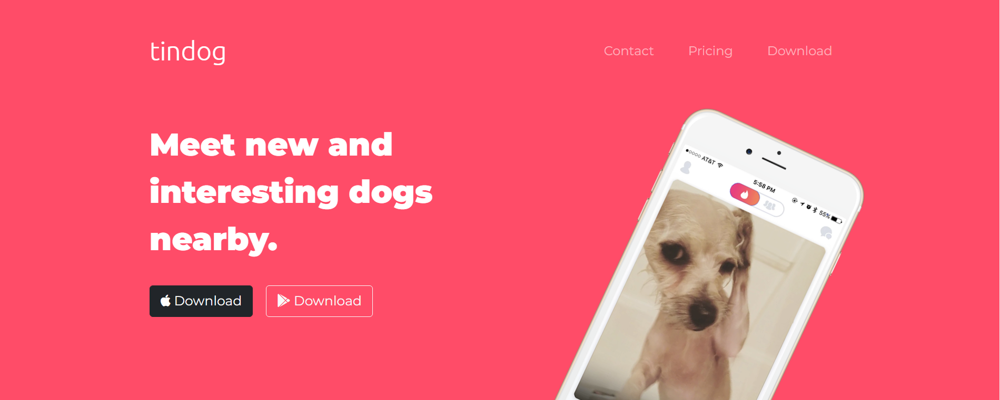

# Tindog

A simple and responsive landing page for a fictional app called Tindog, inspired on Tinder ;)

To check the page just click on the link: https://mylenaverspeelt.github.io/tindog-webpage

<h3 align="left">Tech Stacks & Tools</h3>
    

    
    
    
 

    

Developed by: Mylena Verspeelt 🦜

<a href="https://www.linkedin.com/in/mylenaverspeelt" target="_blank">LinkedIn</a>

 

